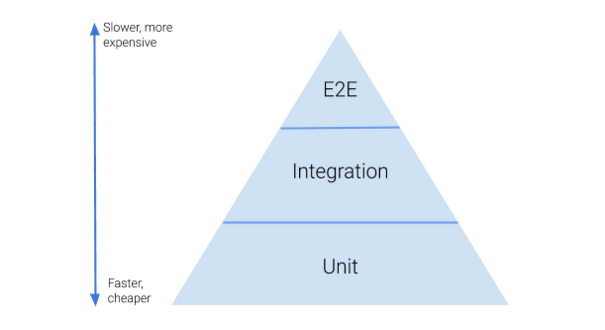

# JunitTutorial

## What is unit testing

Unit testing is a type of software testing that focuses on individual units or components of a software system. The purpose of unit testing is to validate that each unit of the software works as intended and meets the requirements. Unit tests are designed to validate the smallest possible unit of  code, such as a function or a method, and test it in isolation from the  rest of the system. This allows developers to quickly identify and fix  any issues early in the development process, improving the overall  quality of the software and reducing the time required for later  testing.

More Details [here](https://www.geeksforgeeks.org/unit-testing-software-testing)

## Test Pyramid

## Junit User guide

[User Guide](https://junit.org/junit5/docs/current/user-guide)

## Junit Annotations

1. @BeforeEach

   > Denotes that the annotated method should be executed *before* **each** `@Test`, `@RepeatedTest`, `@ParameterizedTest`, or `@TestFactory` method in the current class; analogous to JUnit 4’s `@Before`. Such methods are *inherited* – unless they are *overridden* or *superseded* (i.e., replaced based on signature only, irrespective of Java’s visibility rules).

2. @AfterEach

   > Denotes that the annotated method should be executed *after* **each** `@Test`, `@RepeatedTest`, `@ParameterizedTest`, or `@TestFactory` method in the current class; analogous to JUnit 4’s `@After`. Such methods are *inherited* – unless they are *overridden* or *superseded* (i.e., replaced based on signature only, irrespective of Java’s visibility rules).

3. @BeforeAll

   > Denotes that the annotated method should be executed before all @Test, @RepeatedTest, @ParameterizedTest, and @TestFactory methods in the current class; analogous to JUnit 4’s @BeforeClass. Such methods are inherited – unless they are hidden, overridden, or superseded, (i.e., replaced based on signature only, irrespective of Java’s visibility rules) – and must be static unless the "per-class" test instance lifecycle is used.

4. @AfterAll

   > Denotes that the annotated method should be executed after all @Test, @RepeatedTest, @ParameterizedTest, and @TestFactory methods in the current class; analogous to JUnit 4’s @AfterClass. Such methods are inherited – unless they are hidden, overridden, or superseded, (i.e., replaced based on signature only, irrespective of Java’s visibility rules) – and must be static unless the "per-class" test instance lifecycle is used.

5. @Disabled

   > Used to [disable](https://junit.org/junit5/docs/current/user-guide/#writing-tests-disabling) a test class or test method; analogous to JUnit 4’s `@Ignore`.

6. @RepeatedTest

   > Used to denote that test will be executed mulitple times

7. @ParameterizedTest

   > Denotes that a method is a [parameterized test](https://junit.org/junit5/docs/current/user-guide/#writing-tests-parameterized-tests). 

More annotations can be found [here](https://junit.org/junit5/docs/current/user-guide/#writing-tests-annotations)

## Mocking

Mocking is creating objects that simulate the behaviour of real objects. To use mocking, add mockito library to you class path. And annotate your test class with @ExtendWith(MockitoExtension.class)

### How to create mocks

1. Using **Mockito.mock()**

> ClassToMock mock = Mockito.mock(ClassToMock.class)

2. Using **@Mock** Annotation

   > @Mock
   >
   > ClassToMock classToMock

### How to Create the class under test and inject mocks 

1. Using **new operator**

   > ClassUnderTest class = new ClassUnderTest(mock)

2. Using **@InjectMocks** annotation

   > @InjectMocks
   >
   > ClassUnderTest class;

### Configuring Mocks

1. Configuring mock for non-void methods

   > Mocktito.when(random.nextInt(anyInt()))
   >
   > ​	.thenReturn(50)

2. Configuring mocks for void methods

   > Mockito.doNothing().when(random.nextInt())

### Mockito internals

To dive deeper into mockito refer [here](https://medium.com/@gorali/how-mockito-works-7d3a2c77da71)

### verify cookbook

To dive deeper into verify refer [here](https://www.baeldung.com/mockito-verify)

### Argument Captor

To dive deeper into verify refer [here](https://www.baeldung.com/mockito-argumentcaptor)

### Spy

To dive deeper into verify refer [here](https://www.baeldung.com/mockito-spy)

### [Source code GitHub link](https://github.com/nasasatyanasa/JunitTutorial)

